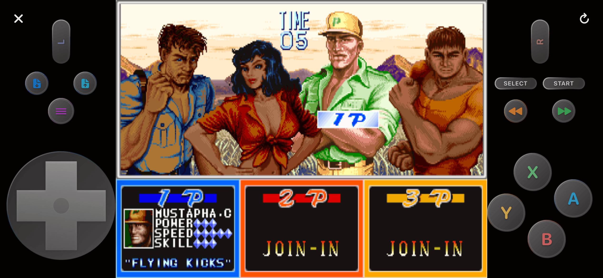
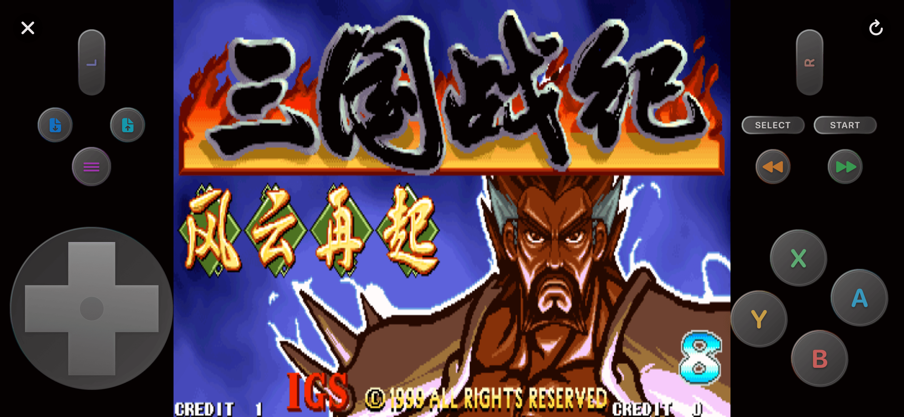
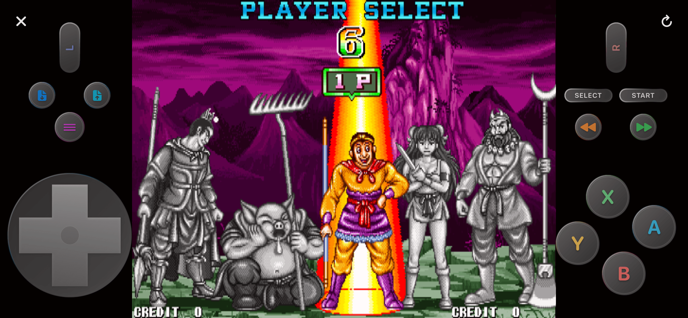
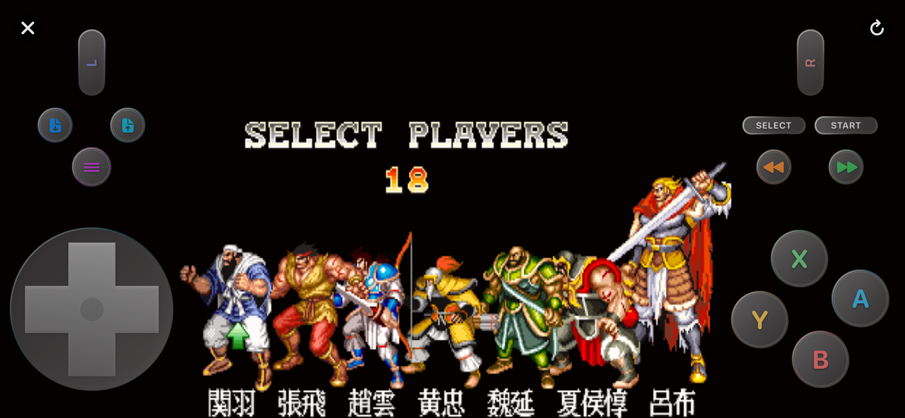
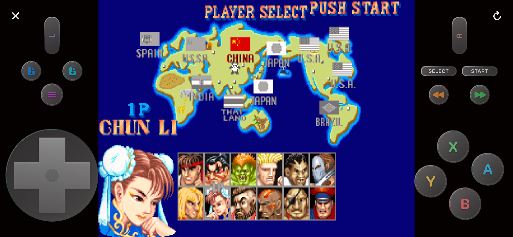
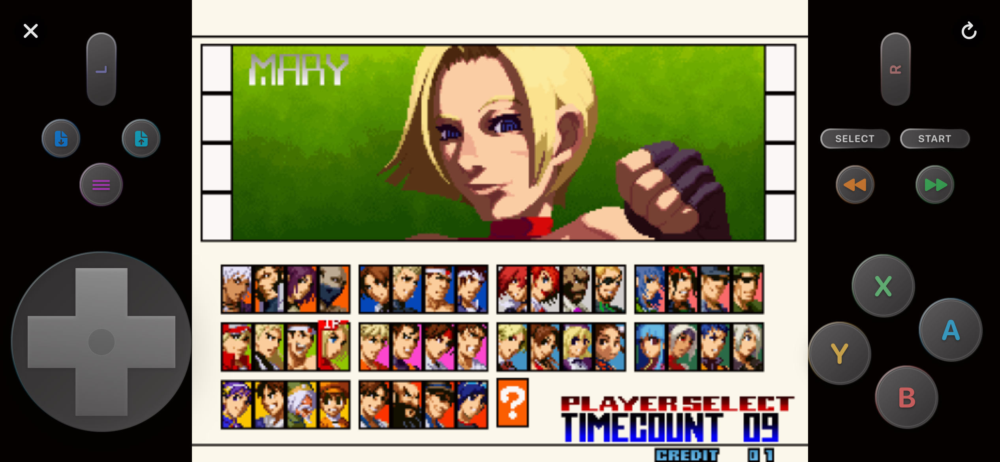
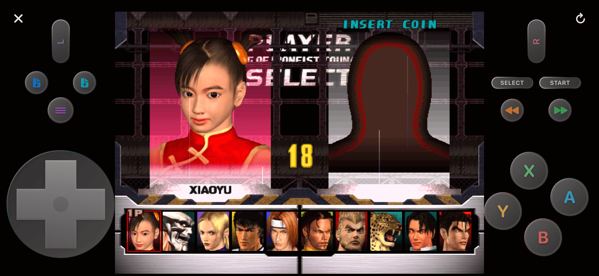
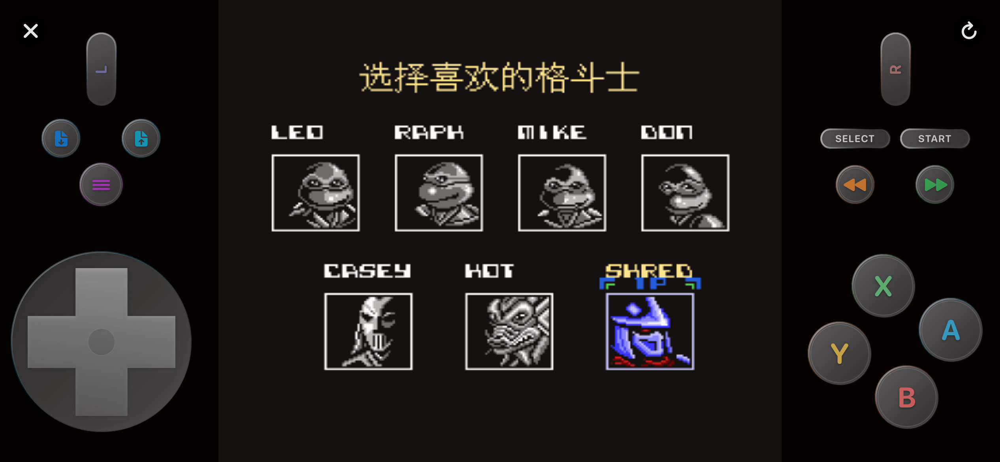
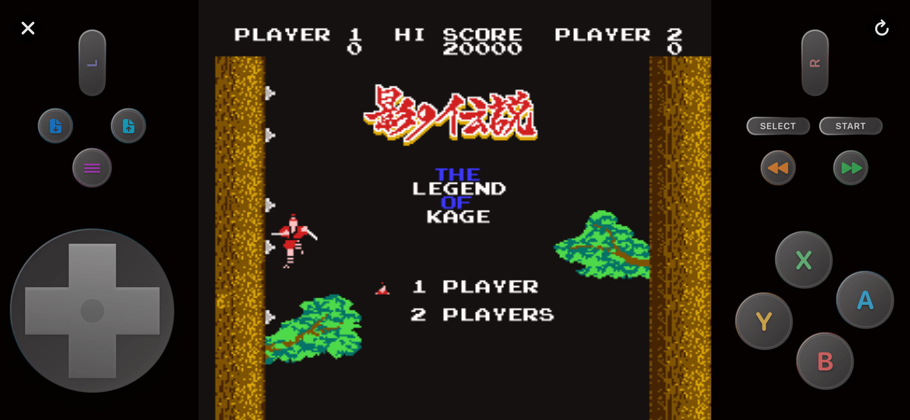

# [English](./README.md) | 简体中文

# 无论是红白机 (FC/NES)、超级任天堂 (SFC)、GameBoy 系列 (GB/GBA)、NDS，还是索尼 PlayStation (PS1)、任天堂 64 (N64)、世嘉 MD，甚至是街机 (NeoGeo、PGM)，iROM都能通吃，支持即点即玩。

# 一、欢迎点击进入我的App Store主页下载本人已上架发布的应用。

> [App Store主页](https://apps.apple.com/cn/developer/%E5%BC%BA-%E6%9B%BE/id1453461397)
# 关注Telegram频道，获取最新信息。

> [t.me/iTelecast](https://t.me/iTelecast)

# 二、下载iOS端模拟器应用：iROM

### [iROM视频教程](https://www.bilibili.com/video/BV1QRAWzyECm/)
###【QQ群】：597187529
### iROM最好使用体验：
### 1、iPhone/iPad通过：系统设置-蓝牙，蓝牙连接无线手柄（PS5手柄、Xbox手柄等），iROM此时自动可用无线手柄。
### 2、iPhone/iPad通过系统顶部下拉菜单“屏幕镜像”，投屏到Apple TV/iMac/MacBook等苹果设备，特别注意：屏幕镜像投屏的只是游戏画面，而非整个应用界面。
### 3、实现无线手柄大屏幕玩游戏体验。大屏iPad也可以直接使用不投屏。

# 三、iROM应用截图

