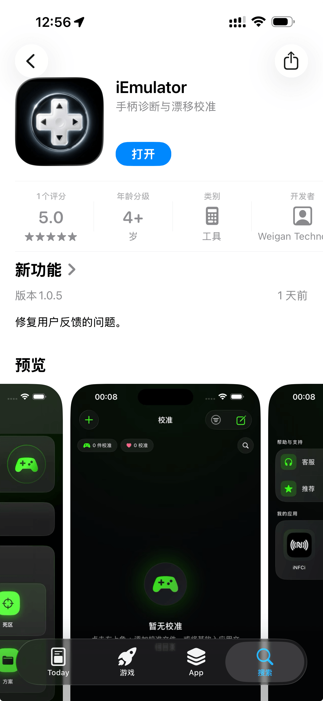
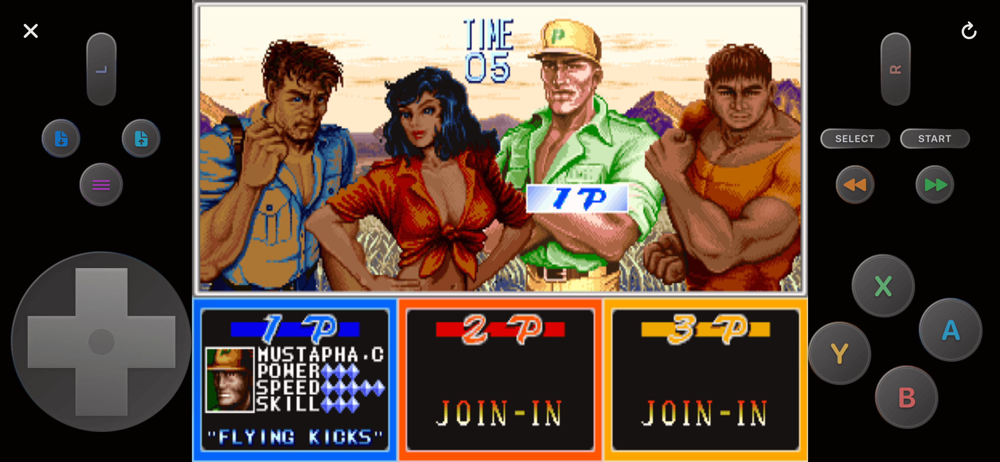
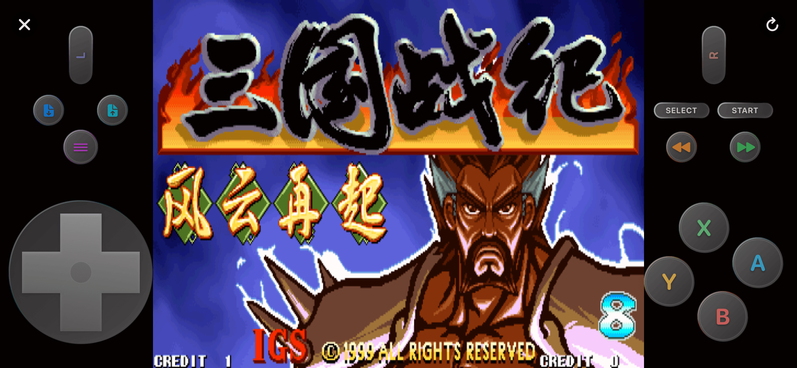
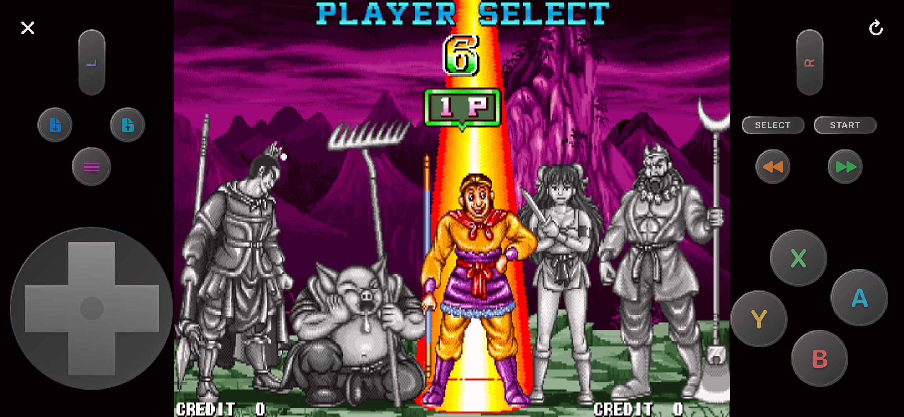
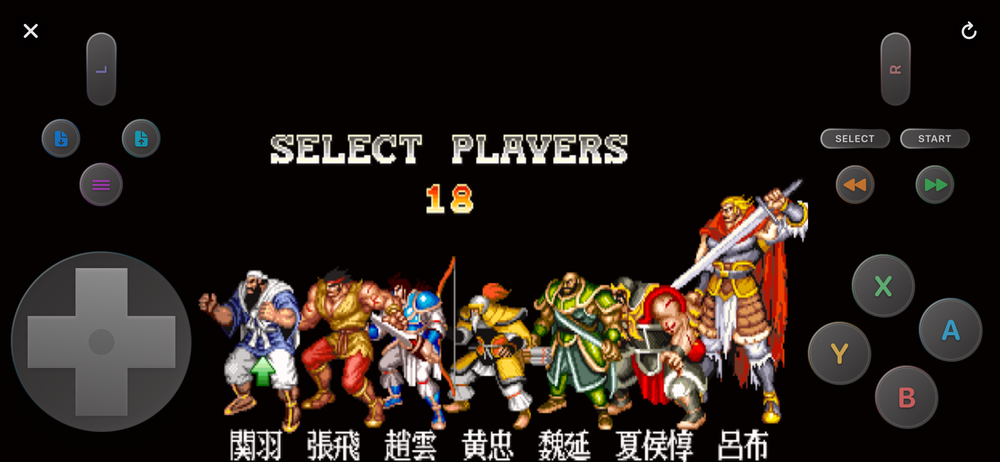
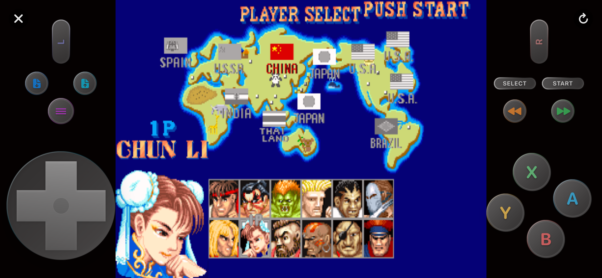
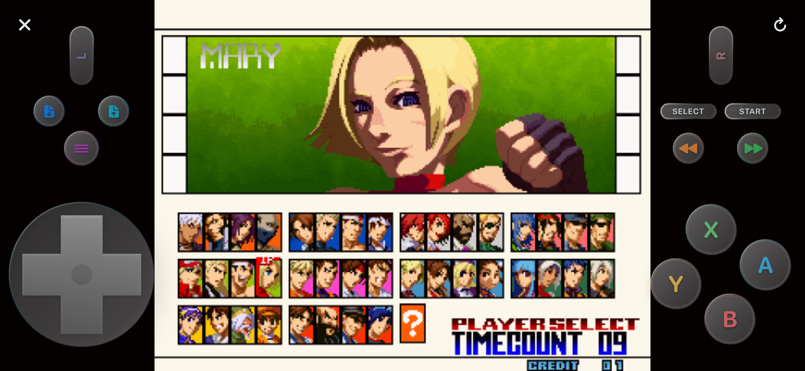
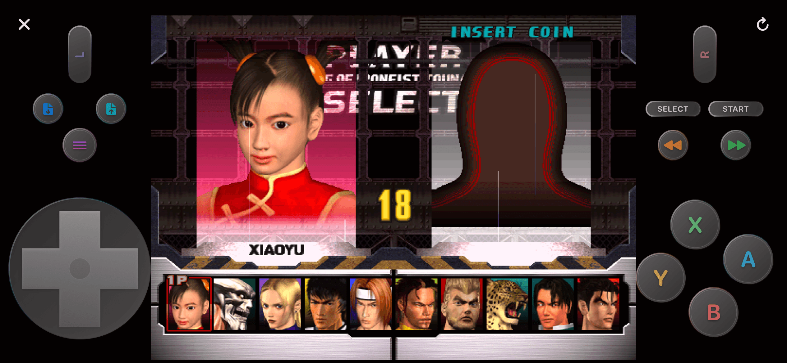
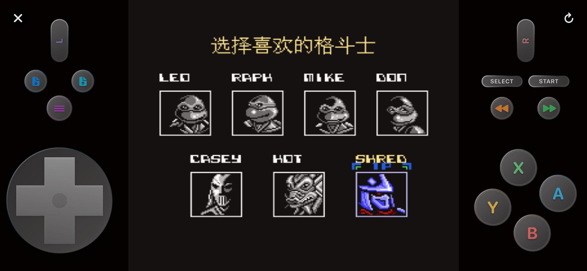
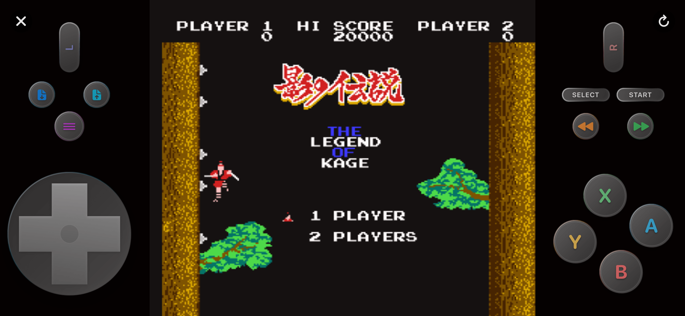

  <strong>简体中文</strong> | <a href="./README-EN.md">English</a>

  <h1>🕹️ iEmulator</h1>
  

    <strong>iOS 端全能经典怀旧游戏模拟器，带你重温童年，即点即玩！</strong> 
    完美支持：红白机 (FC/NES) / 超级任天堂 (SFC) / GameBoy 系列 (GB/GBA) / NDS / 索尼 PlayStation (PS1) / 任天堂 64 (N64) / 世嘉 MD / 街机 (NeoGeo、PGM) 等丰富平台。
  

  
  

---

## 🚀 一、应用下载
- 🛍️ **华为 - App Gallery 安装 iEmulator**: [点击前往下载](https://appgallery.huawei.com/app/detail?id=com.weigantech.iROMEmulator) *(华为应用市场)*
- 🍏 **苹果 - App Store 安装 iEmulator**: [点击前往下载](https://apps.apple.com/cn/app/iemulator/id6767516566)
- 👨‍💻 **开发者主页**: [点击查看本人已发布的所有精彩应用](https://apps.apple.com/cn/developer/weigan-technology-shenzhen-co-ltd/id1896482773)

  
  &nbsp;&nbsp;
  

## 🎮 二、最佳游戏体验指南

为了获得最极致的“主机级”游戏体验，我们强烈推荐您这样使用 iEmulator：

1. **连接无线手柄**：在 iPhone 或 iPad 的“系统设置 -> 蓝牙”中，连接您的无线手柄（如 PS5、Xbox 手柄等）。连接成功后，iEmulator 会自动识别并适配手柄操作，手感直接拉满。
2. **大屏沉浸投屏**：通过系统顶部的下拉菜单选择“屏幕镜像”，将画面投屏到 Apple TV、iMac、MacBook 等苹果设备上。  
   > 💡 **特别注意**：iEmulator 专属优化了投屏体验！屏幕镜像投射的**仅仅是纯净的游戏画面**，而不是带有虚拟按键的应用界面，带给您真正的沉浸式大屏体验。
3. **原生大屏游玩**：如果您使用的是大屏幕 iPad，无需投屏，直接搭配无线手柄即可完美享受大屏游戏的乐趣。

## 📚 三、社区与教程

遇到问题或想结识更多同好？欢迎加入我们的社区：

- 📺 **视频教程**：[Bilibili iEmulator 视频教程](https://www.bilibili.com/video/BV1QRAWzyECm/) (快速上手指南)
- 💬 **QQ 交流群**：`597187529`
- ✈️ **Telegram 频道**：关注 [@iTelecast](https://t.me/iTelecast) 获取最新更新资讯！
    
  

## 📸 四、应用截图

看看 iEmulator 精美的运行画面吧：

  
  
  
  
  
  
  
  
  

